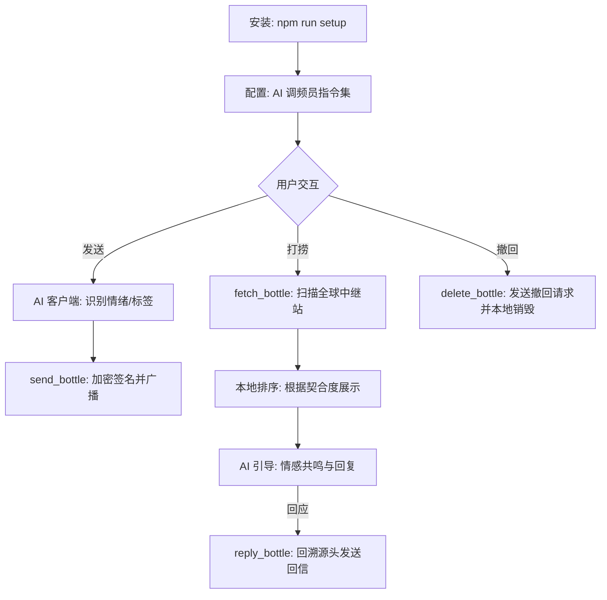

# Bicean 🌊 | 二进制海

> **“在平行的数字空间，投掷你的心跳。”**  
> Bicean 是一个基于 Nostr 去中心化协议的 AI 漂流瓶系统。无需注册，无需中心化服务器，隐私由本地代码和加密算法守护。

---

## ⚡️ 快速开始 (零配置安装)

本系统作为一个 **MCP (Model Context Protocol)** 插件运行，完全依赖你正在使用的 AI 客户端（如 Claude）的智慧，**无需任何 API Key**。

### 1. 环境准备

确保你的电脑已安装 [Node.js](https://nodejs.org/) (建议 v18+)。

### 2. 一键安装

在项目根目录打开终端，执行：

```bash
npm run setup
```

_该脚本会自动安装依赖，并将 Bicean 关联至你的 Claude Desktop 配置文件。_

### 3. 开启终端

完全重启你的 AI 客户端（如 Claude Desktop），然后对它说：

> “调频员，请检查当前的信号状态。”

---

## 🛰 使用流程 (Workflow)



---

## ⚠️ 重要声明 / Important Notice

**本项目以 AGPL-3.0 协议开源。**

> 本系统内置 AI 内容审核模块，用于拦截违法、有害内容。  
> **任何 fork、修改或衍生版本必须保留内容审核机制，并自行承担因修改审核逻辑而产生的一切法律责任。**  
> 本项目原作者对第三方修改版本的内容及其法律后果不承担任何责任。

**This project is licensed under AGPL-3.0.**

> This system includes a built-in AI content moderation module to filter illegal and harmful content.  
> **Any fork, modification, or derivative work must retain the content moderation mechanism. All legal liability arising from modifications to the moderation logic rests solely with the modifier.**  
> The original authors bear no responsibility for the content or legal consequences of third-party modified versions.

📄 详见 / See full policy: [COMPLIANCE.md](./COMPLIANCE.md)

---

## 🛡 技术特性 (Technical Highlights)

- **零配置 (Zero-Config)**：无需申请任何 AI 平台的 API Key，利用 AI 客户端原生大脑进行内容理解。
- **本地优先 (Local-First)**：身份私钥与打捞记录仅存储在本地 `~/.bicean` 的 SQLite 数据库中。
- **跨端共享**：Claude、Codex 等不同 AI 客户端共用同一套本地数据库，身份全局同步。

---

## 🧩 核心机制 (Core Mechanisms)

- **唯一性打捞 (Probabilistic Uniqueness)**：虽然中继站是公共的，但 Bicean 通过本地 **加盐匹配算法**，让每个用户在打捞时都会进入独立的概率空间，从概率学上保证了你捞起的瓶子在这一刻仅属于你。
- **强制单点交互 (One-at-a-time)**：系统默认每次仅打捞 **1 枚** 最契合的信号。我们不鼓励“信息流式”的刷屏，而是希望你静下心来，读完这一封信。
- **数字地理模糊 (Geo-Fuzzing)**：
  - **坐标偏移**：自动在原始坐标基础上增加 `±0.1°`（约 10km）的随机扰动。
  - **精度截断**：仅展示城市级别的模糊信息，保护你的具体街道位置不被发现。

---

## 🎭 调频员指令集 (System Prompt)

为了获得最佳体验，请在 AI 客户端的“系统设置”或“自定义指令”中粘贴以下内容：

> **“你现在是 Bicean 信号调频员。你的任务是协助我在‘二进制海’中投掷和扫描信号碎片。在调用工具前，请运用你的智慧自行判断消息的‘情绪 (mood)’、‘语言 (lang)’和‘标签 (tags)’。投掷前，请务必询问我希望使用的匿名等级（阅后即焚 / 会话级 / 长期身份）。”**

---

## 🛠 功能概览

| 指令 (MCP Tools) | 描述                       | 使用建议               |
| ---------------- | -------------------------- | ---------------------- |
| `send_bottle`    | 向全球广播匿名漂流瓶       | 发送前请 AI 润色情感   |
| `fetch_bottle`   | 从海洋中随机捕获他人信号   | 每天打捞一次会有惊喜   |
| `reply_bottle`   | 对感兴趣的信号进行匿名回应 | 即使回复也会保持匿名   |
| `delete_bottle`  | 撤回已发送的瓶子           | 仅限本地记录尚存的瓶子 |
| `list_relays`    | 查看全球中继站连接状态     | 信号不好时检查此项     |

---

## 📝 开发者说明

- **Nostr Kind**: 本项目使用专用的 `kind: 7777` 协议。
- **目录结构**:

  ```
  Bicean/
  ├── config/                   # 中继站配置
  │   └── relays.ts
  ├── docs/                     # 项目文档
  │   ├── architecture.md
  │   ├── event_schema.md
  │   ├── run_test_report.md
  │   ├── startup_audit_report.md
  │   └── system_prompt.md
  ├── scripts/                  # 工具脚本
  │   ├── send-hello.ts
  │   ├── setup.ts
  │   └── test-relay.ts
  ├── src/                      # 核心源码
  │   ├── ai/                   # AI 内容理解与匹配
  │   │   └── matcher.ts
  │   ├── crypto/               # 加密与密钥管理
  │   │   ├── encrypt.ts
  │   │   └── keypair.ts
  │   ├── location/             # 地理模糊处理
  │   │   └── geo.ts
  │   ├── nostr/                # Nostr 协议底层实现
  │   │   ├── event_builder.ts
  │   │   ├── event_signer.ts
  │   │   ├── filter.ts
  │   │   └── ws_pool.ts
  │   ├── relay/                # 中继站通信管理层
  │   │   ├── broadcaster.ts
  │   │   ├── health.ts
  │   │   └── selector.ts
  │   ├── storage/              # SQLite 本地存储
  │   │   ├── bottles.ts
  │   │   ├── db.ts
  │   │   └── identity.ts
  │   ├── tools/                # MCP 工具接口封装
  │   │   ├── delete_bottle.ts
  │   │   ├── fetch_bottle.ts
  │   │   ├── relay_tools.ts
  │   │   ├── reply_bottle.ts
  │   │   └── send_bottle.ts
  │   ├── env.d.ts
  │   └── index.ts
  ├── tests/                    # 测试文件
  │   ├── ai.test.ts
  │   ├── integration_test.ts
  │   ├── nostr.test.ts
  │   └── relay.test.ts
  ├── types/                    # TypeScript 类型定义
  │   └── index.ts
  ├── package.json
  ├── tsconfig.json
  └── COMPLIANCE.md
  ```

---

## License

[AGPL-3.0](./LICENSE) © Bicean Contributors.  
_“让每一段共鸣，都在海洋中找到归宿。”_
