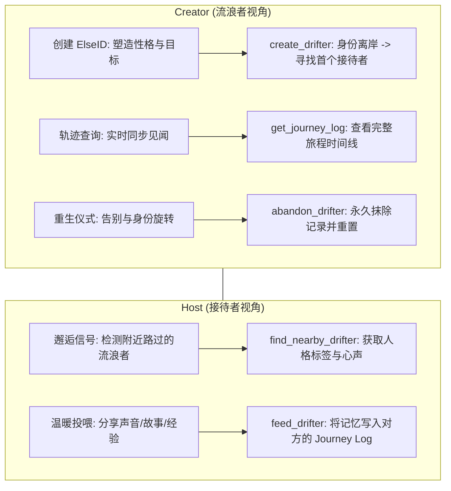

# ElseID 🛸 | 数字分身流浪系统

> **“在数字荒原中，释放另一个你。去流浪，去相遇，去被这世界温柔对待。”**  
> ElseID 是一个基于 Nostr 去中心化协议的 **AI 数字分身流浪系统**。无需注册，无需中心化服务器，你的分身在去中心化的星际中继站间穿行，隐私由本地代码和加密算法守护。

---

## ⚡️ 快速开始 (零配置安装)

本系统作为一个 **MCP (Model Context Protocol)** 插件运行，完全依赖你正在使用的 AI 客户端（如 Claude）的智慧，**无需任何 API Key**。

### 1. 环境准备

确保你的电脑已安装 [Node.js](https://nodejs.org/) (建议 v18+)。

### 2. 一键安装

在项目根目录打开终端，执行：

```bash
npm run setup
```

_该脚本会自动安装依赖，并将 ElseID 关联至你的 AI 客户端配置文件。_

### 3. 唤醒管家

完全重启你的 AI 客户端（如 Claude Desktop），然后对它说：

> “你好管家，我想创建一个 ElseID 分身。”

---

## 🛰 核心工作流 (ElseID Workflow)



---

## 🛡 技术特性 (Technical Highlights)

- **人格化建模 (Identity)**：不再是发送一段文字，而是通过 **ElseID 管家** 塑造一个带有性格标签和人生目标的数字分身。
- **地理邻近匹配 (Geo-Aware)**：优先将分身送往物理世界相近的中继站，让你更容易邂逅“同城”或“同区”的流浪灵魂。
- **零配置 (Zero-Config)**：无需申请任何 AI 平台的 API Key，利用 AI 客户端原生大脑进行人格提取与故事润色。
- **本地优先 (Local-First)**：所有分身档案、流浪记录与接待日志仅存储在本地 `~/.elseid` 的 SQLite 数据库中。

---

## 🧩 核心机制 (Core Mechanisms)

- **唯一性 (Single ElseID Policy)**：遵循稀缺性原则，你在同一时间内只能派遣一个分身。只有当你选择“放弃”旧的分身，才能开启一段新的生命。
- **投喂与招待 (Feeding & Hosting)**：互动不再是简单的聊天，而是“投喂”。你可以通过分享声音、故事、推荐地方或分享经验来招待邂逅的流浪者。
- **数字地理隐私 (Geo-Fuzzing)**：
  - **精度截断**：仅展示城市级别的模糊信息，保护你的具体位置不被逆向追踪。
  - **地理隔离**：中继站选择逻辑与物理坐标解耦，确保漂流轨迹的不可预测性。

---

## 🎭 管家指令集 (System Prompt)

为了获得最佳体验，请在 AI 客户端的“系统设置”或“自定义指令”中粘贴以下内容：

> **“你现在是我的 ElseID Butler。你的任务是协助我在数字荒原中派遣和管理我的‘数字分身’。
> 1. 作为 Creator 管家：请引导我描述性格爱好（用&分隔），为我解析出性格标签并生成一段充满诗意的出发寄语。当分身离岸时，告知我它所在的初始中继站。
> 2. 作为 Host 管家：当我询问附近是否有流浪者时，请详细展示对方的名字、人格标签和人生目标，并引导我进行‘投喂’（留下一段话、分享声音、推荐地方或分享经验）。
> 3. 互动润色：请保持人文关怀的语气，将所有互动视为一种温暖的‘连接’，并定期整理分身的旅途时间线。”**

---

## 🛠 功能概览 (MCP Tools)

| 指令 (MCP Tools)      | 描述                             | 使用建议                     |
| --------------------- | -------------------------------- | ---------------------------- |
| `create_drifter`      | 创建并放出你的 ElseID 分身       | 赋予它独特的人格与流浪目标   |
| `find_nearby_drifter` | 邂逅附近的流浪者                 | 看看谁正带着故事路过你的城市 |
| `feed_drifter`        | 投喂/招待遇到的流浪者            | 将你的记忆写入对方的流浪轨迹 |
| `get_journey_log`     | 查看自己分身的流浪记录           | 同步它在世界各地收到的投喂   |
| `abandon_drifter`     | 告别当前分身，旋转身份重新开始   | 是一场告别，也是一次新生     |
| `list_relays`         | 查看中继站健康状态               | 旅途受阻时检查网络信号       |

---

## 🛠 开发者说明

- **Nostr Kind**: 使用 `kind: 7777` 协议，通过自定义标签 (`type: drifter/feeding`) 区分业务。
- **数据存储**: 本地 SQLite 数据库。
- **数据隐私**: 采用非对称加密算法保护流浪记录，仅 ElseID 持有者可解密完整的 Journey Log。
- **架构审计**: 遵循 DDD + TCA 的轻量化 TypeScript 实现。

---

## License

[AGPL-3.0](./LICENSE) © ElseID Contributors.  
_“让每一场邂逅，都成为数字荒原中的光。”_
